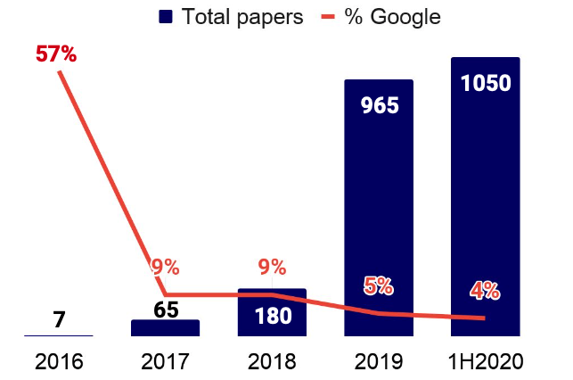

# Awesome Federated Learning
A curated list of research in federated learning. Link to the code if available is also present. You are very welcome to pull request by using our template.

<!--  -->
Federated learning research is booming. We organize the papers by their targeting problem and by conference. 

> Last update: 04 Dec, 2020

## General Resources

- [Awesome Federated Learning](#awesome-federated-learning)
  - [General Resources](#general-resources)
  - [Paper (By research area)](#paper-by-research-area)
  - [Paper (By conference and journal)](#paper-by-conference-and-journal)
    - [Blogs](#blogs)
    - [Survey](#survey)
    - [Benchmarks](#benchmarks)
    - [Video](#video)
    - [Frameworks](#frameworks)
    - [Company](#company)

## Paper (By research area)

- [Statistical Heterogeneity](./areas/statistical-heterogeneity.md)
- [Communication Efficiency](./areas/communication-efficiency.md)
- [System](./areas/system.md): federated learning system design, frameworks, edge AI, etc.
- [Trustworthiness](./areas/trustworthiness.md): privacy, security, fairness
- [Decentralzied FL](./areas/decentralized-fl.md)
- [Applications](./areas/applications.md)
- [Vertical FL](./areas/vertical-fl.md)
- [FL + {X}](./areas/fl+x-learning.md): FL + reinforcement learning, FL + transfer learning, etc. 

* **Communication-Efficient Learning of Deep Networks from Decentralized Data** [[Paper]](https://arxiv.org/abs/1602.05629) [[Github]](https://github.com/roxanneluo/Federated-Learning) [Google] **[Must Read]**

## Paper (By conference and journal)

- [Federated learning paper by conferences](conferences.md): NIPS, ICML, ICLR, etc.
- [Federated learning paper by journal](journal.md)

---

### Blogs

* Federated Learning Comic [[Google Blog]](https://federated.withgoogle.com/)
* Federated Learning: Collaborative Machine Learning without Centralized Training Data [[Google Blog]](http://ai.googleblog.com/2017/04/federated-learning-collaborative.html)

### Survey

* **Federated Machine Learning: Concept and Applications** [[Paper]](https://dl.acm.org/citation.cfm?id=3298981)
* **Federated Learning: Challenges, Methods, and Future Directions** [[Paper]](https://arxiv.org/abs/1908.07873)
* **Advances and Open Problems in Federated Learning** [[Paper]](https://arxiv.org/abs/1912.04977)
* Federated Learning White Paper V1.0 [[Paper]](https://www.fedai.org/static/flwp-en.pdf)
* Federated Learning Systems: Vision, Hype and Reality for Data Privacy and Protection [[Paper]](https://arxiv.org/abs/1907.09693)
* Federated Learning in Mobile Edge Networks: A Comprehensive Survey [[Paper]](https://arxiv.org/abs/1909.11875)
* Federated Learning for Wireless Communications: Motivation, Opportunities and Challenges [[Paper]](https://arxiv.org/abs/1908.06847)
* A Review of Applications in Federated Learning [[Paper]](https://www.sciencedirect.com/science/article/abs/pii/S0360835220305532)

### Benchmarks

* LEAF: A Benchmark for Federated Settings [[Paper]](https://arxiv.org/abs/1812.01097) [[Github]](https://github.com/TalwalkarLab/leaf) [Recommend]
* The OARF Benchmark Suite: Characterization and Implications for Federated Learning Systems [[Paper]](https://arxiv.org/abs/2006.07856)
* Performance Optimization for Federated Person Re-identification via Benchmark Analysis [[Paper]](https://arxiv.org/abs/2008.11560) [ACMMM20] [[Github]](https://github.com/cap-ntu/FedReID)
* A Performance Evaluation of Federated Learning Algorithms [[Paper]](https://www.researchgate.net/profile/Gregor_Ulm/publication/329106719_A_Performance_Evaluation_of_Federated_Learning_Algorithms/links/5c0fabcfa6fdcc494febf907/A-Performance-Evaluation-of-Federated-Learning-Algorithms.pdf)
* Edge AIBench: Towards Comprehensive End-to-end Edge Computing Benchmarking [[Paper]](https://arxiv.org/abs/1908.01924)

### Video

* GDPR, Data Shotrage and AI (AAAI-19) [[Video]](https://aaai.org/Conferences/AAAI-19/invited-speakers/#yang)
* Federated Learning: Machine Learning on Decentralized Data (Google I/O'19) [[Youtube]](https://www.youtube.com/watch?v=89BGjQYA0uE)

### Frameworks

* PySyft [[Github]](https://github.com/OpenMined/PySyft)
  * A Generic Framework for Privacy Preserving Peep Pearning [[Paper]](https://arxiv.org/abs/1811.04017)
* Tensorflow Federated [[Web]](https://www.tensorflow.org/federated)
* FATE [[Github]](https://github.com/FederatedAI/FATE)
* FedLearner [[Github]](https://github.com/bytedance/fedlearner) ByteDance
* Baidu PaddleFL [[Github]](https://github.com/PaddlePaddle/PaddleFL)
* Nvidia Clara SDK [[Web]](https://developer.nvidia.com/clara)
* [Flower.dev](https://flower.dev/)

### Company

* Adap [[Website]](https://adap.com/): Fleet Intelligence
* Privacy.ai [[Website]](https://privacy.ai/)
* OpenMined [[Website]](https://www.openmined.org/)
* Arkhn [[Website]](https://arkhn.org/en/): Healthcare data
* Owkin [[Website]](https://owkin.com/): Medical research
* Snips [[Website]](https://snips.ai/): Voice platform
* XAIN [[Website]](https://www.xain.io/) [[Github]](https://github.com/xainag/xain-fl): Automated Invoicing
* S20 [[Website]](https://www.s20.ai/): Multiple third party collaboration
* DataFleets [[Website]](https://www.datafleets.com/)
* Decentralized Machine Learning [[Website]](https://decentralizedml.com/)
